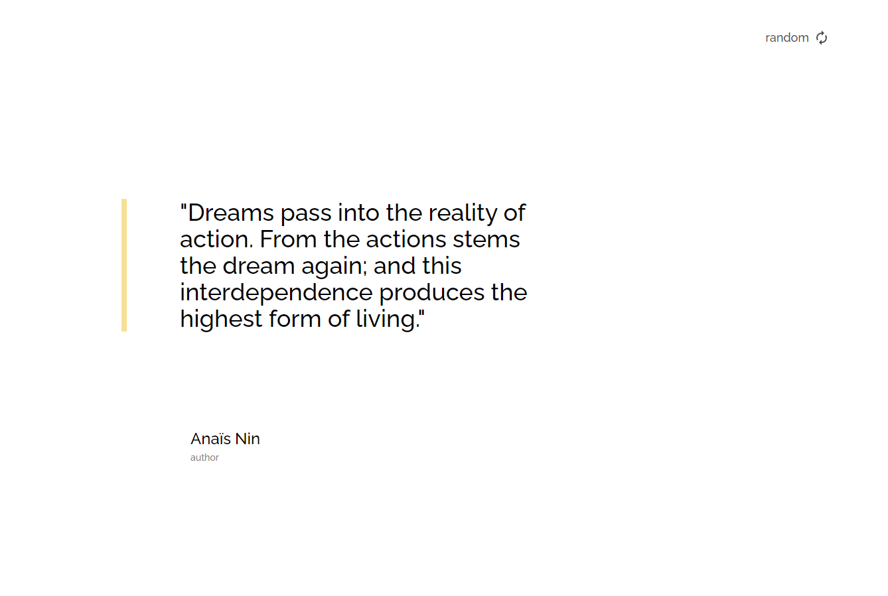

<!-- Please update value in the {}  -->

<h1 align="center">TODO-APP-TJIGRIS</h1>

<div align="center">
   Solution for a challenge from  <a href="http://devchallenges.io" target="_blank">Devchallenges.io</a>.
</div>

<div align="center">
  <h3>
    <!-- // modificar start -------------------------------------------------------------------- -->
    <a href="https://random-quote-generator-tjigris.netlify.app/">
      Demo
    </a>
    <span> | </span>
    <a href="https://{github.com/TJIGRIS/RANDOM-QUOTE-GENERATOR-TJIGRIS.git}">
      Solution
    </a>
    <!-- // modificar end -------------------------------------------------------------------- -->
    <span> | </span>
    <a href="https://devchallenges.io/challenges/3JFYedSOZqAxYuOCNmYD">
      Challenge
    </a>
  </h3>
</div>

<!-- TABLE OF CONTENTS -->

## Table of Contents

- [Overview](#overview)
  - [Built With](#built-with)
- [Features](#features)
- [How to use](#how-to-use)
- [Contact](#contact)

<!-- OVERVIEW -->

## Overview

<!-- // modificar start -------------------------------------------------------------------- -->



- Where can I see your demo?

just click on the random button to get a new quote and on the author's name to see all the quotes and if you want to go back, click on the back button.

- What was your experience?

I was able to connect to an api very easily and provide the necessary data.

<!-- // modificar end -------------------------------------------------------------------- -->

- What have you learned/improved?

Improved my time by doing these projects and bug fixes

- Your wisdom? :)

Don't give up until the end

### Built With

<!-- This section should list any major frameworks that you built your project using. Here are a few examples.-->

- [React](https://reactjs.org/)
- [Tailwind](https://tailwindcss.com/)

## Features

<!-- List the features of your application or follow the template. Don't share the figma file here :) -->

This application/site was created as a submission to a [DevChallenges](https://devchallenges.io/challenges) challenge. The [challenge](https://devchallenges.io/challenges/3JFYedSOZqAxYuOCNmYD) was to build an application to complete the given user stories.

## How To Use

<!-- Example: -->

To clone and run this application, you'll need [Git](https://git-scm.com) and [Node.js](https://nodejs.org/en/download/) (which comes with [npm](http://npmjs.com)) installed on your computer. From your command line:

```bash
# // modificar start --------------------------------------------------------------------

# Clone this repository
$ git clone https://github.com/TJIGRIS/RANDOM-QUOTE-GENERATOR-TJIGRIS.git

# // modificar end --------------------------------------------------------------------

# Install dependencies
$ npm install

# Run the app
$ npm start
```

## Contact

- Website [Portfolio-TJIGRIS](https://{tjigris.github.io/porfolio/})
- GitHub [@TJIGRIS](https://{github.com/TJIGRIS})
